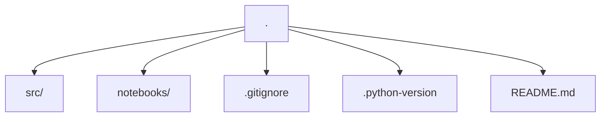
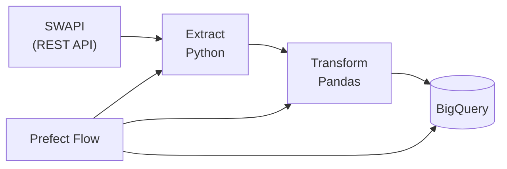

# SWAPI Data Engineering Pipeline (API -> BigQuery)

> End-to-end data engineering pipeline that ingests data from the Star Wars API (SWAPI), **performs** transformations with Python and Pandas, and loads it into BigQuery using Prefect for orchestration.

## Key Features
- Ingests data from **SWAPI** (REST API)
- Modular extract/transform/load steps in **Python**
- Orchestrated with **Prefect** (logging, retries, deployments)
- Loads curated datasets into **BigQuery** (primary) and **PostgreSQL** (optional/local dev)
- Clear separation of bronze, silver, and gold tables (where applicable)
- **Destination:** BigQuery (primary). PostgreSQL is optional for local development.

## Tech Stack
- Python, Pandas
- Prefect
- Google Cloud Storage 
- BigQuery
- Postgres
- Docker

## Project Structure

### Architecture

The pipeline is orchestrated with Prefect, which coordinates API ingestion, transformations, and loading into BigQuery.

## Set up Environment
```bash
python -m venv .venv
source .venv/bin/activate
pip install -r requirements.txt
```

## Run the Pipeline
```
python -m src.flows.swapi_pipeline
```

## Lessons Learned
- Designing API ingestion pipelines
- Handling nested API data for analytical modeling
- Orchestrating cloud data workflows with Prefect
- Managing credentials and secret safely in public repositories.