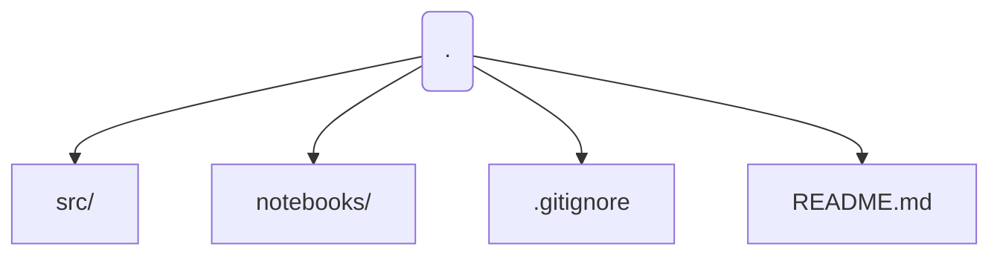
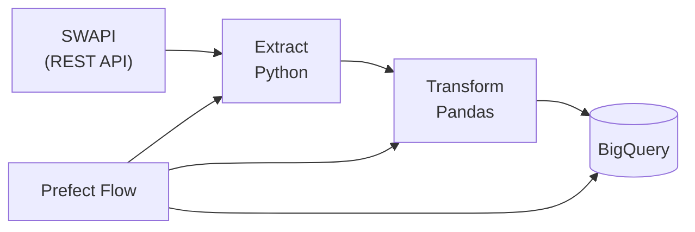

# SWAPI Data Engineering Pipeline (API -> BigQuery)

End-to-end data engineering project that extracts data from the Star Wars API (SWAPI), transforms it with Python/Pandas, and loads analytics-ready tables into BigQuery. The pipeline is orchestrated with Prefect.

## Key Features
- Ingests data from **SWAPI** (REST API)
- Modular extract/transform/load steps in **Python**
- Orchestrated with **Prefect** (logging, retries, deployments)
- Loads curated datasets into **BigQuery** (primary) and **PostgreSQL** (optional/local dev)
- Clear separation of bronze, silver, and gold tables (where applicable)

## Tech Stack
- Python, Pandas
- Prefect
- Google Cloud Storage 
- BigQuery
- Postgres
- Docker

## Project Structure




## Set up Environment
```bash
python -m venv .venv
source .venv/bin/activate
pip install -r requirements.txt
```

## Run the Pipeline
```
python -m src.flows.swapi_pipeline
```